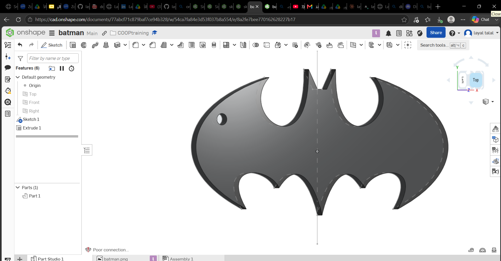

# 🦇 Batman Keychain

## Onshape Design

🔗 https://cad.onshape.com/documents/77abcf71c879baf7ce94b328/w/54ca7fa84e3d53f037b8a554/e/8a2fe7bee770162628227b17?renderMode=0&uiState=6a57cdcd0304265e3b513799

## Project Overview

This project was created as part of a mechanical design training task. The Batman logo was recreated in Onshape and converted into a 3D printable keychain.

## Specifications

- Keyring hole: 4 mm
- Thickness: 2 mm
- File format: STL

## Tools Used

- Onshape
- GitHub

## Files

- `Batman_Keychain.stl` – 3D printable model.

## Preview

## Author

**Layal Aljohani**
